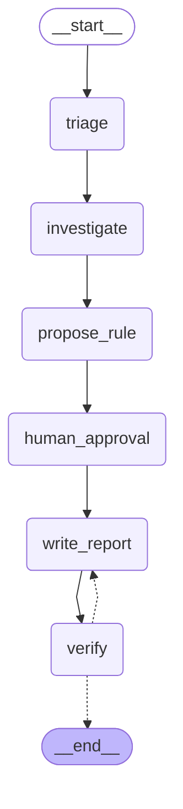

# Compiled investigation graph

Generated from graph.get_graph().draw_mermaid().

```mermaid
---
config:
  flowchart:
    curve: linear
---
graph TD;
	__start__([<p>__start__</p>]):::first
	triage(triage)
	investigate(investigate)
	propose_rule(propose_rule)
	human_approval(human_approval)
	write_report(write_report)
	verify(verify)
	__end__([<p>__end__</p>]):::last
	__start__ --> triage;
	human_approval --> write_report;
	investigate --> propose_rule;
	propose_rule --> human_approval;
	triage --> investigate;
	verify -.-> __end__;
	verify -.-> write_report;
	write_report --> verify;
	classDef default fill:#f2f0ff,line-height:1.2
	classDef first fill-opacity:0
	classDef last fill:#bfb6fc

```
